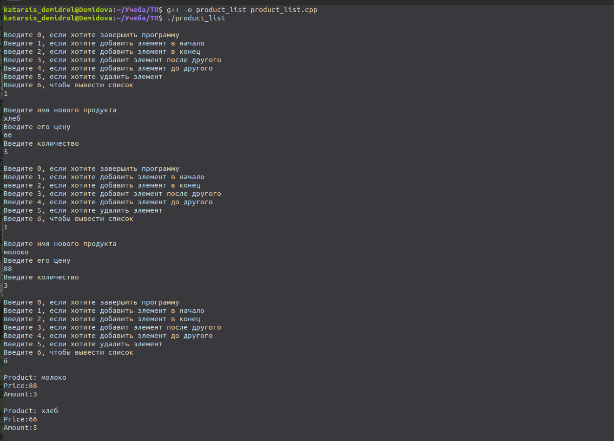
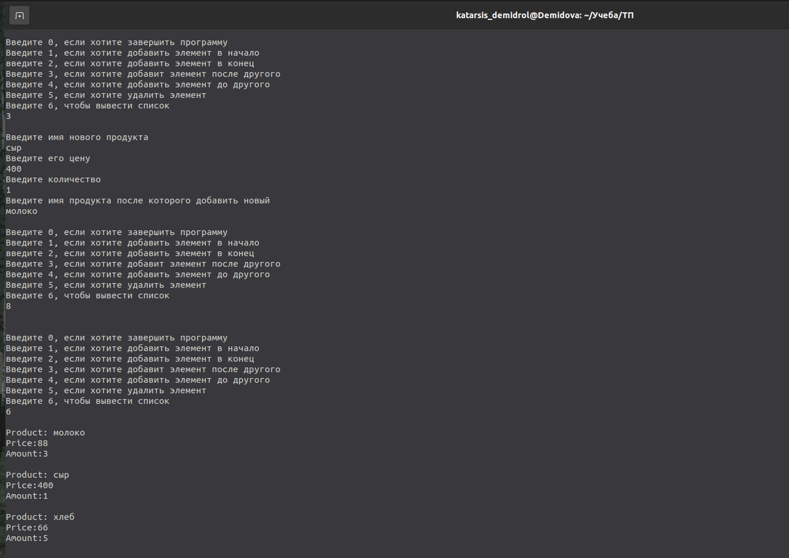
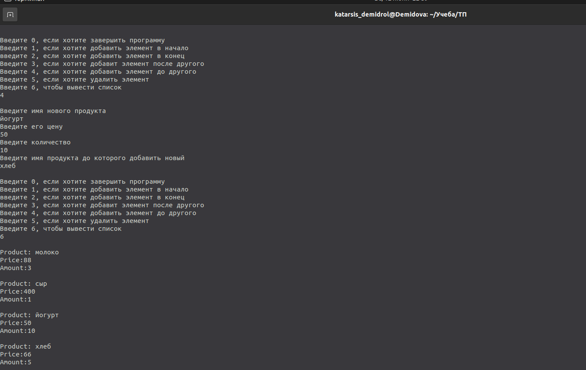

---
## Front matter
title: "Лабораторная работа №1"
subtitle: "Создание списка продуктов"
author: "Демидова Екатерина Алексеевна"

## Generic otions
lang: ru-RU
toc-title: "Содержание"

## Bibliography
bibliography: bib/cite.bib
csl: pandoc/csl/gost-r-7-0-5-2008-numeric.csl

## Pdf output format
toc: true # Table of contents
toc-depth: 2
lof: true # List of figures
lot: false # List of tables
fontsize: 12pt
linestretch: 1.5
papersize: a4
documentclass: scrreprt
## I18n polyglossia
polyglossia-lang:
  name: russian
  options:
	- spelling=modern
	- babelshorthands=true
polyglossia-otherlangs:
  name: english
## I18n babel
babel-lang: russian
babel-otherlangs: english
## Fonts
mainfont: PT Serif
romanfont: PT Serif
sansfont: PT Sans
monofont: PT Mono
mainfontoptions: Ligatures=TeX
romanfontoptions: Ligatures=TeX
sansfontoptions: Ligatures=TeX,Scale=MatchLowercase
monofontoptions: Scale=MatchLowercase,Scale=0.9
## Biblatex
biblatex: true
biblio-style: "gost-numeric"
biblatexoptions:
  - parentracker=true
  - backend=biber
  - hyperref=auto
  - language=auto
  - autolang=other*
  - citestyle=gost-numeric
## Pandoc-crossref LaTeX customization
figureTitle: "Рис."
tableTitle: "Таблица"
listingTitle: "Листинг"
lofTitle: "Список иллюстраций"
lotTitle: "Список таблиц"
lolTitle: "Листинги"
## Misc options
indent: true
header-includes:
  - \usepackage{indentfirst}
  - \usepackage{float} # keep figures where there are in the text
  - \floatplacement{figure}{H} # keep figures where there are in the text
---

# Цель работы

Написать программу на C++ которая реализует работу со списком элементов(товаров). 

# Задание

Каждый элемент (товар) должен иметь следующую структуру:

- Название товара. 
- Цена товара.
- Количество 

Программа должна предлагать пользователю на выбор несколько действий 

- Добавить новый товар во списка. 
- добавить новый товар и конец списка.
- Добавить новый гобар перед существующим выбранным товаром в списке.
- Добавить новый товар после существующего товара в списке. 
- Удалить определенный товар из списка. 
- Вывести на экран информацию о выбранном товаре.
- Вывести на экран весь список целиком.
- Выйти из программы.

Программа должна работать до тех пор, пока пользователь не выберет опцию "Выйти из программы"
Необходимо реализовать следующие функции 

- Создание нового элемента (товара) с помощью ввода с клавиатуры цены и количества
- Добавление созданного элемента в список 
  - В начало списка
  - В конец списка
  - После определенного элемента
  - Перед определенным элементом
- Удаление выбранного мента. 
- Вывод информации об элементе.
- Вывод информации о всех элементах списка.

# Выполнение проекта

Для начала была реализована структура узла, в которой name - переменная наименование товара, p -цена товара, amount - количество товаров, next - ссылка на следующий элемент.


```

struct Product{
	string name;
	float price;
	int amount;
	Product *next;
};

```

Также была реализована функция добавления элемента в начало списка и печати списка:

```
void add_first (Product *&p_product, string new_name, float p, int a){
	Product *new_product = new Product;
	new_product ->name = new_name; 
	new_product ->price = p;
	new_product ->amount = a;
	new_product ->next = p_product;
	p_product = new_product;
};


void print_list(Product *p_product){
	if(p_product == NULL){
		cout << "The list is empty"; return;
	};
	Product *tmp = p_product;
	while (tmp != NULL){
		cout << "Product: "<< tmp->name <<"\nPrice:"<< tmp->price <<"\nAmount:"<<tmp->amount<<"\n\n";
		tmp = tmp->next;
	};
	return;
};

```

Приведём пример использования этих функций. (рис. [-@fig:001])

{ #fig:001 width=70% }

Кроме того, была написана функция для добавления в конец списка. Если в списке нет элементов, то вызывается функция добавления в начало.

```

	Product *tmp = p_product;
	if (p_product == NULL){
		add_first(p_product, new_name, p, a);
		return;
		}
	while (tmp ->next) tmp = tmp->next;
	Product *new_product = new Product;
	new_product->name = new_name;
	new_product->price = p;
	new_product->amount = a;
	new_product->next = NULL;
	tmp->next = new_product;
	return;
};

```

Также была создана функции для удаления элемента. Ей в аргументы поступает голова списка и имя элемента, который необходимо удалить.

```

int del_product(Product *&p_product, string del_name){
	if (p_product = NULL) return 1;
	Product *tmp = p_product;
	if (p_product->name == del_name){
		p_product = p_product->next; 
		delete tmp; 
		return 0;
	}
	if (p_product->next == NULL) return 1;
	Product *prev = p_product; tmp = p_product->next;
	while (tmp->next != NULL && tmp->name != del_name){
		prev = prev->next; 
		tmp = tmp->next;
	}
	if (tmp->next == NULL && tmp->name!=del_name) return 1;	
	prev->next = tmp->next;
	delete tmp;
	return 0;
};

```


Были реализованы функции добавления до определённого элемента и после:

```

int add_after (Product *p_product, string new_name, float p, int a, string name_after){
	if (p_product == NULL) return 1;
	Product *tmp = p_product;
	while (tmp != NULL && tmp->name != name_after){
		tmp = tmp->next;
	}
	if (tmp == NULL) return 1;
	Product *new_product = new Product;
	new_product->name = new_name;
	new_product->price = p;
	new_product->amount = a;
	new_product->next = tmp->next;
	tmp->next = new_product;
	return 0;
};

int add_before(Product *&p_product, string new_name, float p, int a, string name_before){

	if (p_product == NULL) return 1;
	if (p_product->name == name_before){
		add_first(p_product, new_name, p, a);
		return 0;
	}
	if (p_product->next == NULL) return 1;
	Product *prev = p_product, *tmp = p_product->next;
	while (tmp != NULL && tmp->name != name_before){
		prev = prev->next; 
		tmp = tmp->next;
	}
	if (tmp->next == NULL && tmp -> name!=name_before) return 1;
	Product *new_product = new Product;
	new_product->name = new_name;
	new_product->price = p;
	new_product->amount = a;
	new_product->next = tmp;
	prev->next = new_product;
	return 0;
};

```

К ним на вход подаются голова списка, имя нового товара, его цена и количество, а также имя товара до/после которого добавиться новый элемент. (рис. [-@fig:002;-@fig:003])

{ #fig:002 width=70% }

{ #fig:003 width=70% }


# Выводы

В результате выполнения лабораторной работы были получены практические навыки работы со списками, была написана программа на языке C++, в которой реализован список товаров, с помощью неё можно добавлять товары(в конец, в начало, до и после какого-то товара). 

