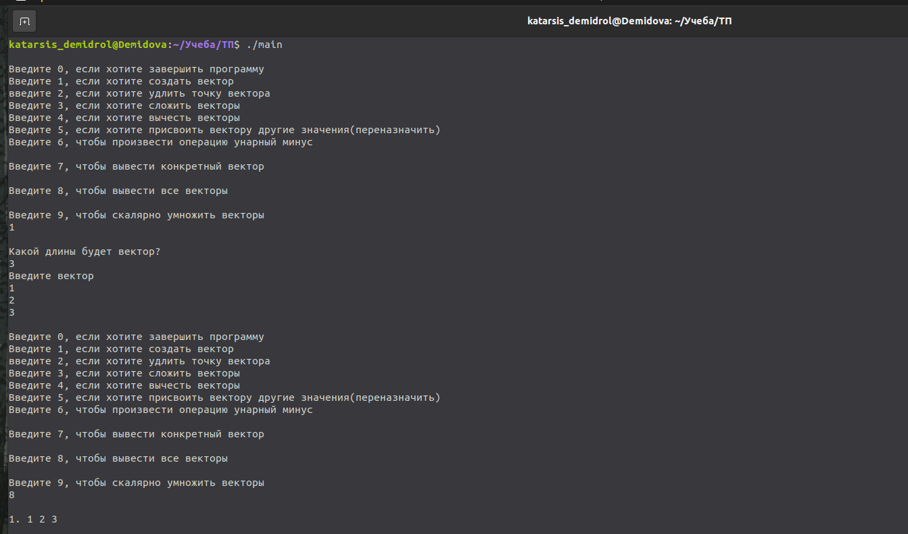
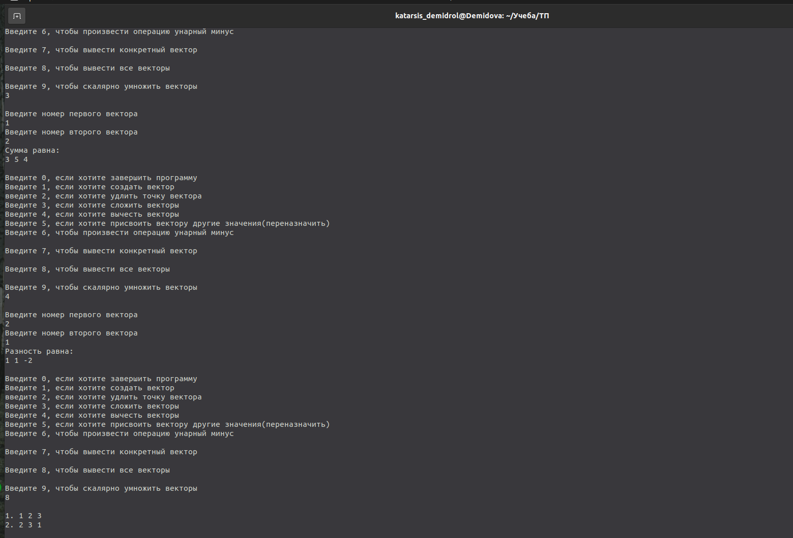
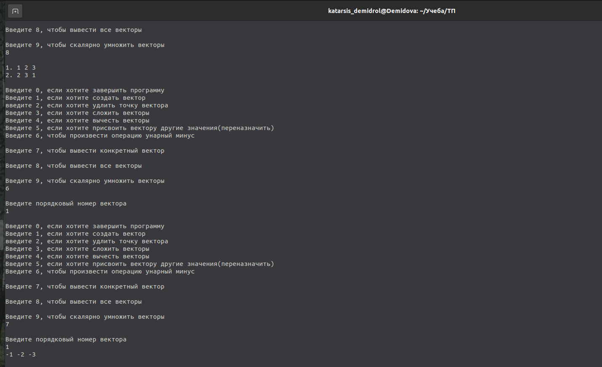
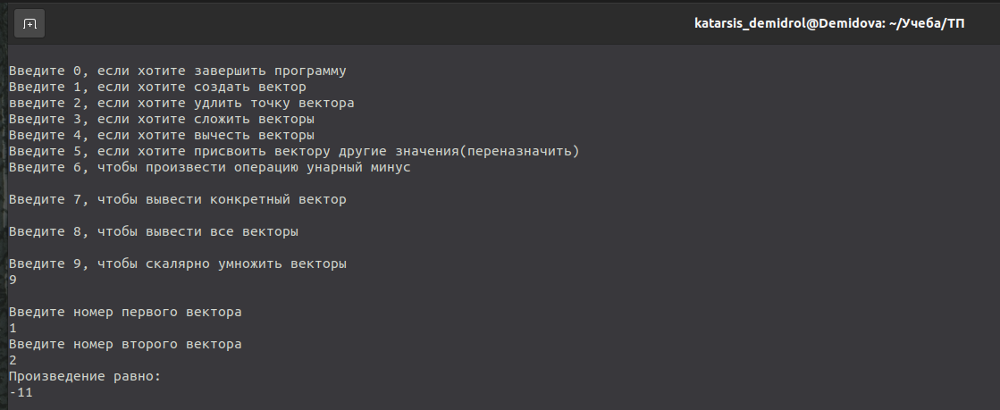
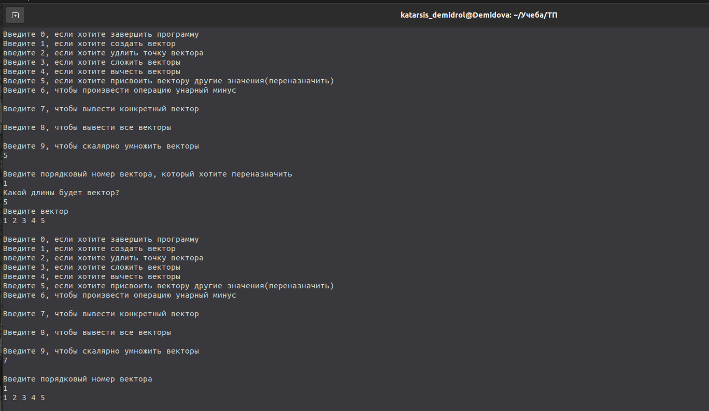

---
## Front matter
title: "Лабораторная работа №2"
subtitle: "Класс векторов"
author: "Демидова Екатерина Алексеевна"

## Generic otions
lang: ru-RU
toc-title: "Содержание"

## Bibliography
bibliography: bib/cite.bib
csl: pandoc/csl/gost-r-7-0-5-2008-numeric.csl

## Pdf output format
toc: true # Table of contents
toc-depth: 2
lof: true # List of figures
lot: false # List of tables
fontsize: 12pt
linestretch: 1.5
papersize: a4
documentclass: scrreprt
## I18n polyglossia
polyglossia-lang:
  name: russian
  options:
	- spelling=modern
	- babelshorthands=true
polyglossia-otherlangs:
  name: english
## I18n babel
babel-lang: russian
babel-otherlangs: english
## Fonts
mainfont: PT Serif
romanfont: PT Serif
sansfont: PT Sans
monofont: PT Mono
mainfontoptions: Ligatures=TeX
romanfontoptions: Ligatures=TeX
sansfontoptions: Ligatures=TeX,Scale=MatchLowercase
monofontoptions: Scale=MatchLowercase,Scale=0.9
## Biblatex
biblatex: true
biblio-style: "gost-numeric"
biblatexoptions:
  - parentracker=true
  - backend=biber
  - hyperref=auto
  - language=auto
  - autolang=other*
  - citestyle=gost-numeric
## Pandoc-crossref LaTeX customization
figureTitle: "Рис."
tableTitle: "Таблица"
listingTitle: "Листинг"
lofTitle: "Список иллюстраций"
lotTitle: "Список таблиц"
lolTitle: "Листинги"
## Misc options
indent: true
header-includes:
  - \usepackage{indentfirst}
  - \usepackage{float} # keep figures where there are in the text
  - \floatplacement{figure}{H} # keep figures where there are in the text
---

# Цель работы

Написать на C++ класс векторов и программу для работы с этим классом. 

# Задание

Написать программу на С ++, которая реализует Класс Vector. Класс Vectог должен иметь следующие поля private : 

- Размерность вектора
- Массив значений вектора
- порядковый номер вектора 

Класс Vector должен иметь следующие поля рubliс:

- Количество созданных векторов (static) 

Необходимо реализовать следующие функции или методы класса:

- Конструктор класса 
- Деструктор 
- Функция отображения вектора и его номера(print) 

Оператор функции: 

- сложения / вычитания векторов 
- унарный минус 
- скалярное умножение
- присваивание

# Выполнение проекта

Private-методы и поля класса определяют его реализацию. Доступ к ним разрешен только из методов данного класса. Были объявлены private-поля класса Vector, а именно arr - массив значений вектора, n - текущее количество точек вектора, capacity - возможное количество точек.

Public-методы и поля класса определяют его интерфейс, доступ к ним возможен из любой части кода. Был создан конструктор класса, в нём массив значений вектора задаётся по умолчанию длины 1, так как далее память под него будет выделяться динамически.


```

Vector(){
	arr = new int[1];
	capacity = 1;
	n = 0;
	
	}

```
 Кроме того был создан деструктор класса.

```

~Vector() {
		delete[] arr;
	}
	
```

Также была реализована функция добавления точки, она выделяет память под точку и добавляет её в конец массива значений:

```

	void push(int data){

        if (n == capacity){

            int* tmp = new int[2*capacity];

            for (int i = 0; i < capacity; i++) {
                tmp[i] = arr[i];
            }
            
            delete[] arr;
            capacity *= 2;
            arr = tmp;
            }
            arr[n] = data;
            n++; 

        } ;

```

Была написана функция для печати вектора.

```
	void print()
        {
        for (int i = 0; i < n; i++) {
            cout << arr[i] << " ";
        }
        cout << endl;
	}

```

Приведём пример использования этих функций. (рис. [-@fig:001])

{ #fig:001 width=80% }


Механизм переопределения действия большинства операций  С++  в отношении объектов классов – описание оператор-функций. При перегрузке операций сохраняется количество операндов, приоритеты выполнения и правила ассоциации. Все операторы написаны вне класса и объявлены внутри него.

Были перегружены операторы сложения/вычитания. Они поэлементно проводят операцию над векторами, проверяя совпадение длины, и возвращают результирующий вектор.

```

Vector Vector::operator + (Vector &r)
{ Vector res;
  if(this->n != r.n) 
  {
  exit(1);
  }
  else{	
  for(int i = 0; i < r.n; i++){
    res.push(r.arr[i] + this->arr[i]);
  }
  }
  return res;
}

Vector Vector::operator - (Vector &r)
{ Vector res;
  if(this->n != r.n) 
  {
  exit(1);
  }
  else{
  for(int i = 0; i < r.n; i++){
    res.push(this->arr[i]-r.arr[i]);
  }
  }
  return res;
}

```

Приведём пример использования этих операторов. (рис. [-@fig:002])

{ #fig:002 width=80% }

Были реализованы оперторы унарный минус и скалярное умножение векторов:

```

Vector Vector::operator - (Vector &r)
{ Vector res;
  if(this->n != r.n) 
  {
  exit(1);
  }
  else{
  for(int i = 0; i < r.n; i++){
    res.push(this->arr[i]-r.arr[i]);
  }
  }
  return res;
}

int Vector::operator * (Vector &r){
	int res=0;
	for(int i =0; i< r.n; i++){
	res += (this->arr[i])*r.arr[i];
	}
	return res;
}

```

Приведём пример использования этих операторов. (рис. [-@fig:003;-@fig:003])

{ #fig:003 width=80% }

{ #fig:004 width=80% }

Также был переопределён оператор присваивания:

```

Vector& Vector::operator = (const Vector &r)
{ delete [] arr;
  this->n = r.n;
  arr=new int[n];
  for (int i = 0; i < n; i++) this->arr[i] = r.arr[i];
  return *this;
}

```

Приведём пример его использования. (рис. [-@fig:005])

{ #fig:005 width=80% }

# Выводы

В результате выполнения лабораторной работы были получены практические навыки работы с классами, была написана программа на языке C++, в которой реализован класс для создания и работы с векторами, а также программа, демонстрирующая возможности этого класса. 

