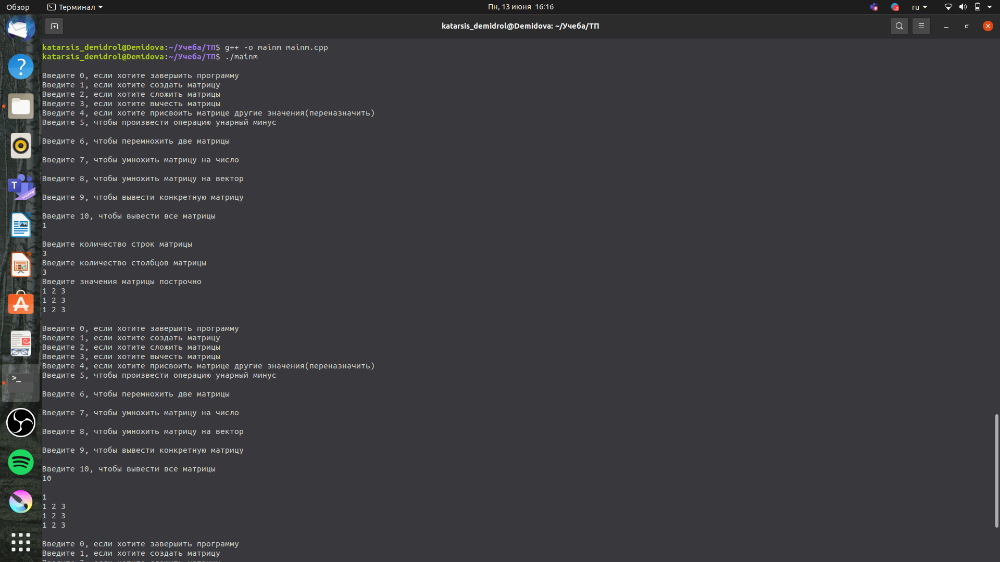
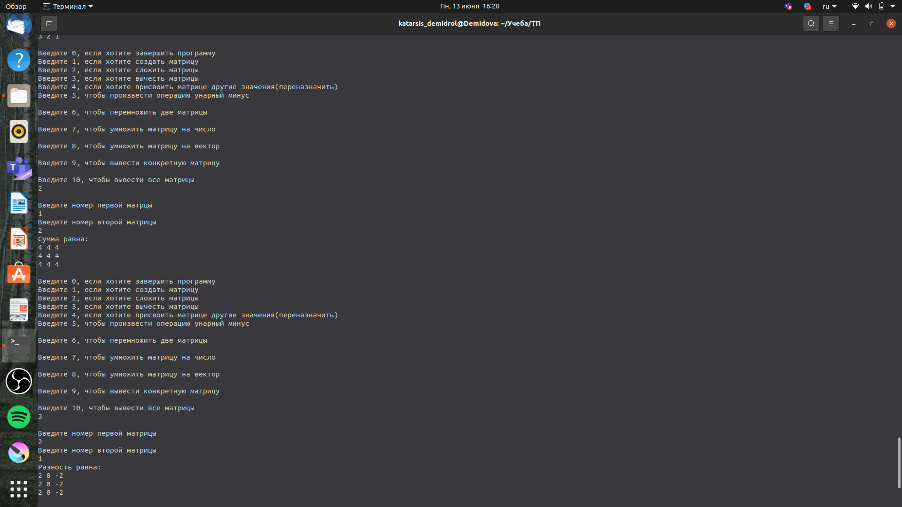
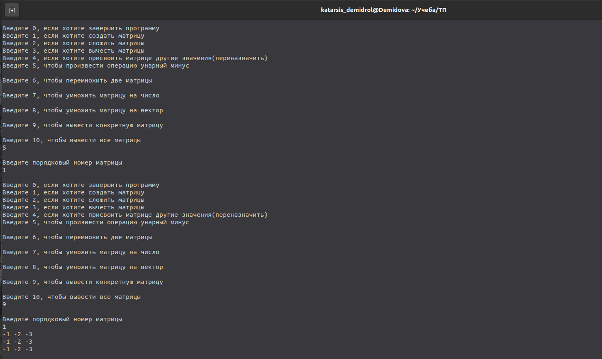
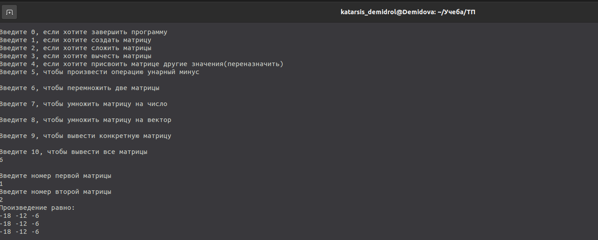
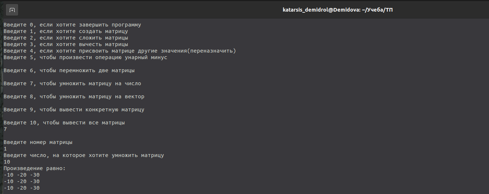
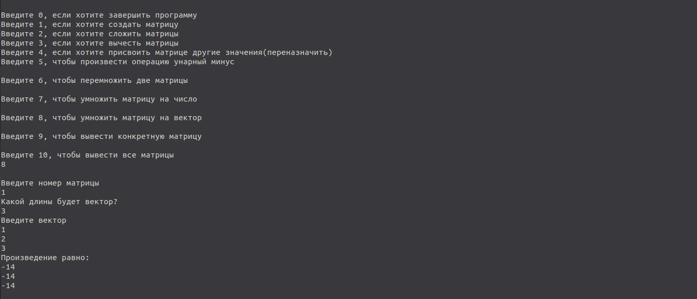
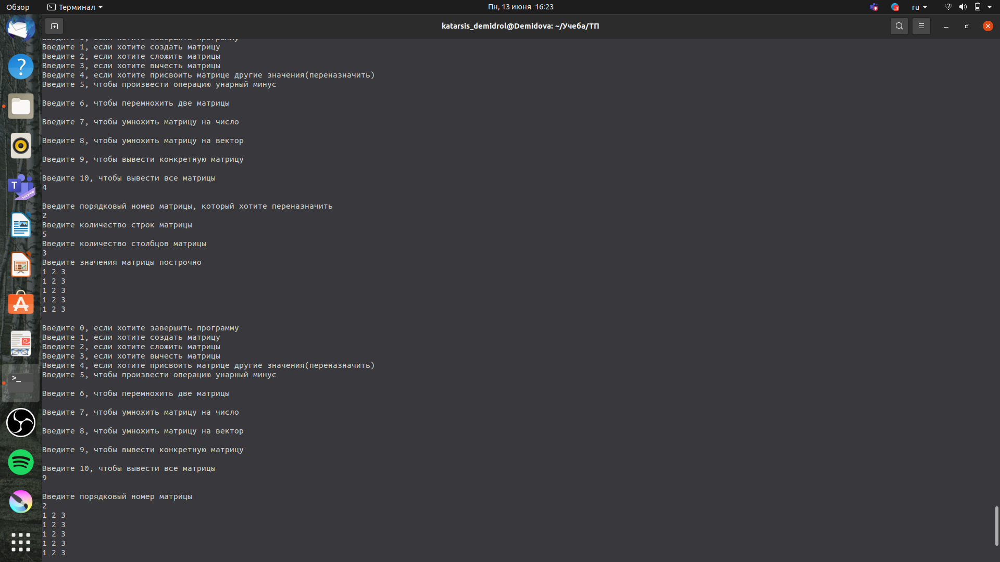

---
## Front matter
title: "Лабораторная работа №3"
subtitle: "Класс матриц"
author: "Демидова Екатерина Алексеевна"

## Generic otions
lang: ru-RU
toc-title: "Содержание"

## Bibliography
bibliography: bib/cite.bib
csl: pandoc/csl/gost-r-7-0-5-2008-numeric.csl

## Pdf output format
toc: true # Table of contents
toc-depth: 2
lof: true # List of figures
lot: false # List of tables
fontsize: 12pt
linestretch: 1.5
papersize: a4
documentclass: scrreprt
## I18n polyglossia
polyglossia-lang:
  name: russian
  options:
	- spelling=modern
	- babelshorthands=true
polyglossia-otherlangs:
  name: english
## I18n babel
babel-lang: russian
babel-otherlangs: english
## Fonts
mainfont: PT Serif
romanfont: PT Serif
sansfont: PT Sans
monofont: PT Mono
mainfontoptions: Ligatures=TeX
romanfontoptions: Ligatures=TeX
sansfontoptions: Ligatures=TeX,Scale=MatchLowercase
monofontoptions: Scale=MatchLowercase,Scale=0.9
## Biblatex
biblatex: true
biblio-style: "gost-numeric"
biblatexoptions:
  - parentracker=true
  - backend=biber
  - hyperref=auto
  - language=auto
  - autolang=other*
  - citestyle=gost-numeric
## Pandoc-crossref LaTeX customization
figureTitle: "Рис."
tableTitle: "Таблица"
listingTitle: "Листинг"
lofTitle: "Список иллюстраций"
lotTitle: "Список таблиц"
lolTitle: "Листинги"
## Misc options
indent: true
header-includes:
  - \usepackage{indentfirst}
  - \usepackage{float} # keep figures where there are in the text
  - \floatplacement{figure}{H} # keep figures where there are in the text
---

# Цель работы

Написать на C++ класс матриц и программу для работы с этим классом. 

# Задание

Написать программу на С ++, которая реализует Класс Matrix. Класс Matrix должен иметь следующие поля private : 

- Размерность матрицы n*m(столбцы,строки)
- Двумерный массив значений матрицы

Класс Matrix должен иметь следующие поля рubliс:

- Количество созданных матриц (static) 

Необходимо реализовать следующие функции или методы класса:

- Конструктор класса 
- Деструктор 
- Функция отображения матрицы(print) 

Оператор функции: 

- сложения / вычитания матриц
- унарный минус 
- умножение матриц
- умножение матрицы на вектор
- умножение матрицы на число
- присваивание

# Выполнение проекта

Private-методы и поля класса определяют его реализацию. Доступ к ним разрешен только из методов данного класса. Были объявлены private-поля класса Matrix, а именно matrix - массив значений матрицы, n - количество столбцов матрицы, m - количество строк матрицы.

Public-методы и поля класса определяют его интерфейс, доступ к ним возможен из любой части кода. Был создан конструктор класса, в нём массив значений вектора задаётся по умолчанию длины 1 на 1, а также возможна передача количества строк и столбцов в аргументы при объявлении.


```

	Matrix(int N=1, int M=1)
	   {
	      n = N;
	      m = M;
	      matrix = new int *[n];
	      
	      for (int i = 0; i < n; ++ i)
	      {
		 matrix[i] = new int[m];
		 for (int j = 0; j < m; ++ j)
		    matrix[i][j] = 0;
	      }
	      
	      
	   }

```
 Кроме того был создан деструктор класса.

```

    	~Matrix() {
		delete[] matrix;
	}
	
	
```

Также была реализована функция чтения матрицы, она добавляет точки в двумерный массив, обращаясь к заданным при объявлении значениям количества строк и столбцов:

```

void scan()
	{
   	//int n, m;
   	//scanf ("%d%d", & n, & m);
   	Matrix matrix = Matrix (this->n, this->m);
   	for (int i = 0; i < n; ++ i){
     		for (int j = 0; j < m; ++ j){
        		cin >> this->matrix[i][j];
        	}
        }
   	
	}

```

Была написана функция для печати вектора.

```
	void print()
        {
        for (int i = 0; i < n; i++) {
            cout << arr[i] << " ";
        }
        cout << endl;
	}

```

Приведём пример использования этих функций. (рис. [-@fig:001])

{ #fig:001 width=90% }


Механизм переопределения действия большинства операций  С++  в отношении объектов классов – описание оператор-функций. При перегрузке операций сохраняется количество операндов, приоритеты выполнения и правила ассоциации. Все операторы написаны вне класса и объявлены внутри него.

Были перегружены операторы сложения/вычитания. Они поэлементно проводят операцию над матрицами, проверяя совпадение размеров, и возвращают результирующую матрицу.

```

Matrix Matrix::operator + (Matrix &r)
{  
   if (r.n != this->n || r.m != this->m){
      cout<< "Разные размеры матриц";
      exit(1);
   }
   Matrix res = Matrix (r.n, r.m);
   for (int i = 0; i < r.n; ++ i){
      for (int j = 0; j < r.m; ++ j){
         res[i][j] = r.matrix[i][j] + this->matrix[i][j];
         }
   
   }
   return res;
}

Matrix Matrix::operator - (Matrix &r)
{  
   if (r.n != this->n || r.m != this->m){
      cout<< "Разные размеры матриц";
      exit(1);
   }
   Matrix res = Matrix (r.n, r.m);
   for (int i = 0; i < r.n; ++ i){
      for (int j = 0; j < r.m; ++ j){
         res[i][j] = this->matrix[i][j] - r.matrix[i][j];
   }
   }
   return res;
}

```

Приведём пример использования этих операторов. (рис. [-@fig:002])

{ #fig:002 width=80% }

Был реализован опертор унарный минус:

```

Matrix Matrix::operator - ()
{ Matrix res = Matrix (this->n, this->m);
  for(int i = 0; i < this->n; i++){
  	for(int j = 0; j < this->m; j++){
    		res.matrix[i][j] = -(this->matrix[i][j]);
  }
  }
  return res;
}

```

Приведём пример его использования. (рис. [-@fig:003])

{ #fig:003 width=90% }


Также был переопределн оператор умножения, а именно для умножения матрицы на матрицу, вектор и число.

```

Matrix Matrix::operator * (int k){
	Matrix res = Matrix (this->n, this->m);
	for (int i = 0; i < this->n; ++i){
     	 	for (int j = 0; j < this->m; ++j){
         		res[i][j] = this->matrix[i][j] * k;
		}
	}
	return res;
}

Matrix Matrix::operator * (Matrix &r){
	if (this->m != r.n){
	     exit(1);
	}
	Matrix res = Matrix (this->n, r.m);
	for (int i = 0; i < this->n; ++ i){
	    for (int j = 0; j < r.m; ++ j){
			for (int k = 0; k < this->m; ++ k){
		    res[i][j] += this->matrix[i][k] * r.matrix[k][j];
			}
		}
	}
	   return res;

}


Matrix Matrix::operator * (Vector &r){
	Matrix res = Matrix(this->n, 1);
	if(r.n!=this->m){
	cout << "Невозможно перемножить";
	    exit(1);
	}
	else{
	for (int i = 0; i < this->n; ++ i){
		for (int j = 0; j < this->m; ++ j){
		    	res[i][0] += this->matrix[i][j] * r.arr[j];
			}
		}
	}
	return res;
	
}

```

Приведём пример использования этих операторов. (рис. [-@fig:004;-@fig:005;-@fig:006])

{ #fig:004 width=90% }

{ #fig:005 width=90% }

{ #fig:006 width=90% }

Также был переопределён оператор присваивания:

```

Matrix &Matrix::operator=(const Matrix& r) 
      {  
        if (this != &r) 
        { 
           for ( int i = 0; i < this->n; i++ )
            {
                delete []matrix[i];
            }
            delete []matrix;
            this->n = r.n;
            this->m = r.m;

            matrix = new int*[n];
            for ( int i = 0; i < this->n; i++ )
            {
                matrix[i] = new int[this->m];
            }
            for (int i= 0; i < r.n; ++i) {
            for (int j = 0; j < r.m; ++j) {
               matrix[i][j] = r.matrix[i][j]; 
            }
            }
        }
   
       return *this;
       
       }

```

Приведём пример его использования. (рис. [-@fig:007])

{ #fig:007 width=90% }

# Выводы

В результате выполнения лабораторной работы были получены практические навыки работы с классами, была написана программа на языке C++, в которой реализован класс для создания и работы с матрицами, а также программа, демонстрирующая возможности этого класса. 

