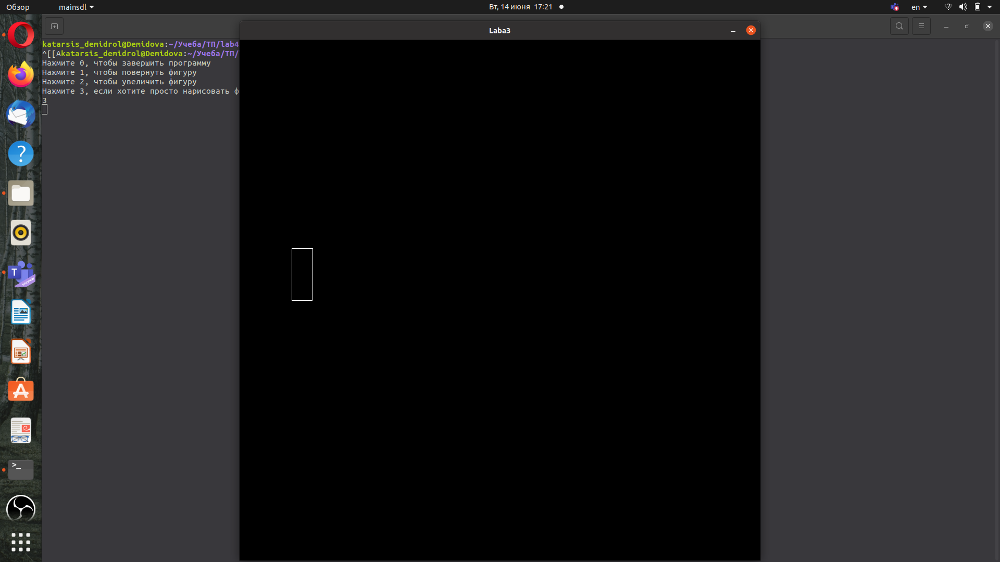
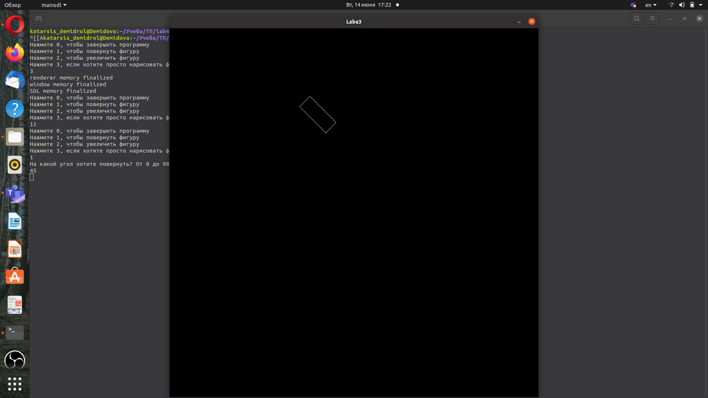
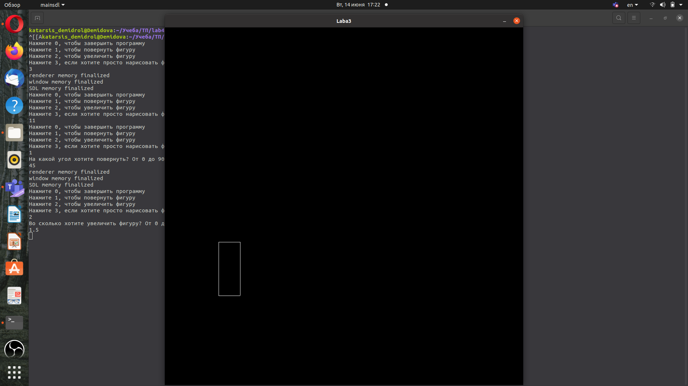
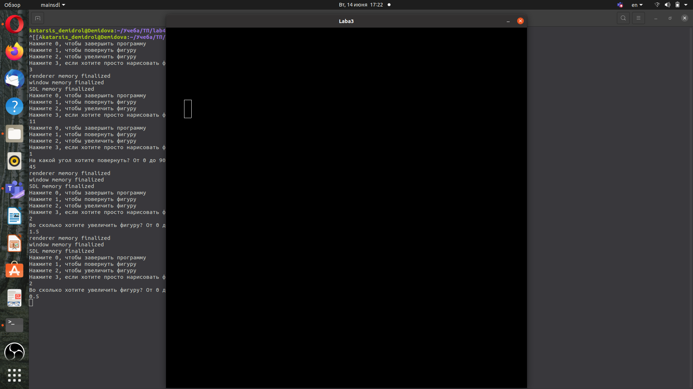

---
## Front matter
title: "Лабораторная работа №4"
subtitle: "Графика"
author: "Демидова Екатерина Алексеевна"

## Generic otions
lang: ru-RU
toc-title: "Содержание"

## Bibliography
bibliography: bib/cite.bib
csl: pandoc/csl/gost-r-7-0-5-2008-numeric.csl

## Pdf output format
toc: true # Table of contents
toc-depth: 2
lof: true # List of figures
lot: false # List of tables
fontsize: 12pt
linestretch: 1.5
papersize: a4
documentclass: scrreprt
## I18n polyglossia
polyglossia-lang:
  name: russian
  options:
	- spelling=modern
	- babelshorthands=true
polyglossia-otherlangs:
  name: english
## I18n babel
babel-lang: russian
babel-otherlangs: english
## Fonts
mainfont: PT Serif
romanfont: PT Serif
sansfont: PT Sans
monofont: PT Mono
mainfontoptions: Ligatures=TeX
romanfontoptions: Ligatures=TeX
sansfontoptions: Ligatures=TeX,Scale=MatchLowercase
monofontoptions: Scale=MatchLowercase,Scale=0.9
## Biblatex
biblatex: true
biblio-style: "gost-numeric"
biblatexoptions:
  - parentracker=true
  - backend=biber
  - hyperref=auto
  - language=auto
  - autolang=other*
  - citestyle=gost-numeric
## Pandoc-crossref LaTeX customization
figureTitle: "Рис."
tableTitle: "Таблица"
listingTitle: "Листинг"
lofTitle: "Список иллюстраций"
lotTitle: "Список таблиц"
lolTitle: "Листинги"
## Misc options
indent: true
header-includes:
  - \usepackage{indentfirst}
  - \usepackage{float} # keep figures where there are in the text
  - \floatplacement{figure}{H} # keep figures where there are in the text
---

# Цель работы

Написать программу на C++ которая визуализирует фигуру и выполняет операции с ней с помощью библиотеки sdl. 

# Задание

- Изучить функционал sdl
- Нарисовать фигуру
- Повернуть фигуру с помощзью умножения на матрицу поворота
- Увеличить фигуру

# Выполнение проекта

Для начала мы установили библиотеку sdl и изучили её функционал. 

Затем создали класс Engine, который нужен для графической визуализации. В нём написали функцию Render, которая нужна для рендеринга прямоугольника. Ей на вход подаются векторы, по которым он строится. В этой функции используются встроенные в библиотеку sdl функции, такие как SDL_SetRenderDrawColor() - задаёт цвет, SDL_RenderDrawLine() - рисует линии, SDL_RenderPresent() - обновляет экран после рендеринга.


```

    void Render(Vector &v1, Vector &v2, Vector &v3, Vector &v4)
    {


    	
        SDL_SetRenderDrawColor(renderer, 0, 0, 0, SDL_ALPHA_OPAQUE);
        SDL_RenderClear(renderer);
        SDL_SetRenderDrawColor(renderer, 255, 255, 255, SDL_ALPHA_OPAQUE);

       SDL_RenderDrawLine(renderer, v1[0], v1[1], v2[0], v2[1]);
        SDL_RenderDrawLine(renderer, v2[0], v2[1], v3[0], v3[1]);
       SDL_RenderDrawLine(renderer, v3[0], v3[1], v4[0], v4[1]);
       SDL_RenderDrawLine(renderer, v4[0], v4[1], v1[0], v1[1]);
        SDL_RenderPresent(renderer);
    };

```

Также была реализована функция для отрисовки фигуры, ей также на вход подаются векторы задающие координаты углов  прямоугольник:

```
    void Run(Vector &vec1, Vector &vec2, Vector &vec3, Vector &vec4)
    {
        Init();
        while (!flagToExit)
        {
            PollsEvent();
            Update();
            Render(vec1, vec2, vec3, vec4);
        }
        SDL_DestroyRenderer(renderer);
        std::cout << "renderer memory finalized"
                  << "\n";
        SDL_DestroyWindow(window);
        std::cout << "window memory finalized"
                  << "\n";
        SDL_Quit();
        std::cout << "SDL memory finalized"
                  << "\n";
    }

```


Перейдём к функции main. В ней был реализован switch-case, в котором пользователю даётся возможность просто нарисовать фигуру, повернуть её и увеличить/уменьшить. Эти возможности реализованы с помощью умножения матриц на вектора.

```

	case 1:
	{
	float grad;
	cout << "На какой угол хотите повернуть? От 0 до 90!!!!\n";
	
	cin >> grad;
	Matrix matr(2,2);
	matr[0][0] = cos(3.1416*grad/180);
    	matr[0][1] = sin(3.1416*grad/180);
    	matr[1][0] = -sin(3.1416*grad/180);
    	matr[1][1] = cos(3.1416*grad/180);
    	
    	Vector v1 = matr*vect1;
    	Vector v2 = matr*vect2;
    	Vector v3 = matr*vect3;
    	Vector v4 = matr*vect4;
    	
    	Engine visualMath = Engine(1000, 1000);
    	visualMath.Run(v1,v2,v3,v4);
	break;
	}


```

```

	case 2:
	{
	float grad;
	cout << "Во сколько хотите увеличить фигуру? От 0 до 2\n";
	cin >> grad;
	Matrix matr(2,2);
	matr[0][0] = grad;
    	matr[0][1] = 0;
    	matr[1][0] = 0;
    	matr[1][1] = grad;
    	
    	Vector v1 = matr*vect1;
    	Vector v2 = matr*vect2;
    	Vector v3 = matr*vect3;
    	Vector v4 = matr*vect4;
    	
    	Engine visualMath = Engine(1000, 1000);
    	visualMath.Run(v1,v2,v3,v4);
    	break;
	}


```

```

	case 3:
	Engine visualMath = Engine(1000, 1000);
    	visualMath.Run(vect1,vect2,vect3,vect4);
	
```

Приведём пример использования этих функций. (рис. [-@fig:001;-@fig:002;-@fig:003;-@fig:004])

{ #fig:001 width=70% }

{ #fig:002 width=70% }

{ #fig:003 width=70% }

{ #fig:004 width=70% }


# Выводы

В результате выполнения лабораторной работы были получены практические навыки работы с библиотекой sdl, была написана программа на языке C++, в которой осуществляется графическое отображение фигуры и операции над ней с помощью матриц. 

